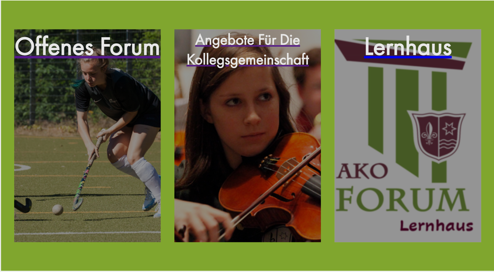

# Projekttagebuch

### Die Dokumentation meiner Arbeit zur Projektarbeit html 

---

## Inhalt

1. [Anfangs Phase](#anfangs-phase)
    - [Vorarbeit/Vorwissen](#vorwissen)
    - [Einrichtung der Tools](#einrichtung)
2. [Konzept Phase](#konzept-phase)
    - [Erstes Kundengespräch](#Kundengespräch)
    - [Erstes Wireframe](#firstWireframe)
3. [Design Phase](#design-phase)
    - [Stunde vom **2.2**](#2.2)
    - [**3 - 5** Februar](#3.2-5.2)
4. [Developing Phase](#developing-phase)
    - [**10 - 12** Februar](#10-12.2)
    - [**13 - 15** Februar](#13-15.2)
    - [**Montag 20 Februar**](#montag-20-februar)
    - [**Dienstag 21 Februar**](#dienstag-21-februar)
5. Integration Phase
6. Veröffentlichung

---

# Anfangs Phase

## Vorarbeit/Vorwissen <a name="vorwissen"></a>

Ich habe schon in Vorbereitung zu der Projektarbeit mir viel Material angeguckt, vor Allem zum Thema Design. Auf diese Thema wollte ich mich bei diesem Projekt fokussieren, da ich im Bereich des Web Developements schon mehr Erfahrung hatte. Hierzu habe ich mir auf YouTube hauptsächlich eine Reihe zu dem Thema angeschaut, die von einem angeblich sehr erfahren Web Designer online zur Verfügung gestellt wurde. [Hier der Link.](https://www.youtube.com/playlist?list=PLXC_gcsKLD6n7p6tHPBxsKjN5hA_quaPI)

---

## <a name="einrichtung"></a> Einrichtung der Tools 

Als wir am **31.1** mit der Arbeit angefangen haben, habe ich erst mal das Github repo entsprechend mit dem Skeleton eingerichtet. Ebenfalls habe ich ein Project Board zum managen von Todos eingerichtet. In der restlichen Stunde habe ich mir von der bestehenden Ako Forum Seite einen Überblick verschafft und schon ein paar Konzept Ideen für die Landing Page auf meinem iPad entwickelt. 

--- 

# Konzept Phase

## Erstes Kundengespräch <a name="Kundengespräch"></a>

Am **Mittwoch, 1.2** hatte ich mein Erstes Gespräch mit Herrn Tabatabei. Dort haben wir ersteinmal die bestehende Ako Forum Seite besprochen, welche Funktionalitäten wichtig sind und welche verbessert werden könnten. Hierbei hat sich für mich Folgendes ergeben: <a name="voraussetzungen"></a>

- Die bestehende Webseite ist klaglos veraltet und besteht nur noch aus einem veralteten WordPress Projekt und existiert schon lange Jahre. 
- Die Hauptfunktionalität der Seite für das Ako Forum selber ist die Anmeldung. Diese verläuft über einen eMail Automatismus, einmal an das Forum und dann an an den Kunden
- Die Bearbeitung der Seite, beispielweise für neuen Blog Inhalt oder neue Kurs info, ist durch fehlende Expertise deutlich erschwert und nicht immer ohne "Kollateraleschaden" (durch bearbeiten einer Sache eine Andere Sache unwiderruflich durcheinanderbringen)

Für mich heißt das, dass ich einen Weg finden muss den einfachen Zugang für das Forum zu gewähren und dabei den eMail Automatismus aufrecht zu erhalten.

***Spezifische Design Ideen haben wir allerdings nicht besprochen.***

---

## Erstes Wireframe <a name="firstWireframe"></a>

In Anschluss an diese Gespräch habe ich am Nachmittag ein erstes schnelles wireframe für die Landing page in Adobe XD entwickelt um eine Idee zu kriegen, wo ich mit welchen Farben arbeiten könnte. Auf Typographie habe ich hier erst einmal keine Rücksicht genommen. 


---

# Design Phase

## Stunde vom **2.2** <a name="2.2"></a>

In der Stunde habe ich mich informiert, welche Tools ich benutzen möchte, um die vorher genannten [Voraussetzungen](#vorraussetzungen) zu erfüllen. Hierbei habe ich mich dazu entschieden eine WordPress Seite zu benutzen, damit man über templates u.Ä. neuen Content einfach hinzufügen kann. Auch die eMail Automation kann man über diese Tool einrichten. Allerdings werde ich erst mal die Seite manuell designen und developen. 

---

## 3 - 5 Februar <a name="3.2-5.2"></a>

An diesem Wochenende habe ich die Landing page weiter designed damit man darunter die Kurskategorien auswählen kann:


Zusätzlich habe ich auch noch die templates für die daran anhängenden Seiten entworfen, wo man dann eine Kurze kursübersicht zu allen Kursen in der Kategorie kriegt und dann zu dem Kurs weitergehen kann.


---

# Developing Phase

## 10 - 12 Februar <a name="10-12.2"></a>

An diesem Wochenende habe aufgrund der sich immer näher rückenden Deadline mit dem Developement Prozess angefangen. Hierbei habe ich mich dazu entschieden nur eine Seite zu entwickeln, da ich sonst keine Zeit dazu habe. 
In den drei Tagen habe ich den CSS flex header geschrieben und den Hero (die titelseite) angefangen, obwohl ich hier bis auf den Titel nicht weit gekommen bin. So sieht es aber bisher aus:


Besonders der flex header ist eher kompliziert da das CSS flexbox Modell nicht immer das macht was man möchte. Im ende hat ungefähr das hier für mich funktioniert. 

```css
header {
  display: flex;
  justify-content: space-between;
  align-items: center;
  height: 12.685vw;
}

.navLinks {
  list-style: none;
  right: 1.041vw;
}

.navLinks li {
  display: inline-block;
  padding: 0 1.041vw;
 
}
```

---

## 13 - 15 Februar <a name="13-15.2"></a>

An den paar Tagen vor den Karnevalsferien habe ich hauptsächlich an daran gearbeitet, die Seite responsive zu machen, also dafür sorgen, dass die Inhalte auf allen bildschirmgrößen adäquat dargestellt werden kann. Hierzu muss ich im CSS code alle werte die eine feste Anzahl sind (px, cm, in) ersetzen durch eine relative (%, vw, rem). Dann habe ich beispielsweise statt diesem code:

```css
.logo {
  width: 105px;
  height: 125px;
  padding-left: 140px;
}
```

diesen code:

```css
.logo {
  width: 9.722vw;
  height: 11.574vw;
  margin-left: 7.29167vw;
}
```

Dies macht die Website viel zugänglicher für Alle und ist einfacher von Anfang an einzuführen, weil zurück gehen und alle werte ersetzen, dann wenn es nötig ist, keine einfache und fehlerlose Lösung ist. 

---

## Montag 20 Februar 

An den beiden letzten Tagen der Karnevalsferien habe ich weiter am developen der Seite gearbeitet. Am Montag habe ich die Karten zur Auswahl der Kurskategorien geschrieben. Hierbei habe ich mich wieder mit `display: flex` auseinander gesetzt. Dieses Mal mit einem besseren Verständnis und ein wenig Geduld habe ich es dieses Mal schneller Geschafft, etwas zu schreiben was funktioniert. Hier war anschließend das schwierige eher jeder Karte das entsprechende Hintergrundbild zu geben und dieses richtig zu positionieren und zu schattieren. Dazu habe ich statt dem im Design ursprünglich vorgesehenen shader (ein schwarzes svg mit 42% Transparenz) eine eher elegantere Lösung verwendet. 

Diese funktioniert indem ich dem `div` die hintergrundfarbe schwarz gebe und diese mit RGBa angebe, so dass ich einen Transparenzwert eingeben kann, also `rgba(0, 0, 0, 0.42)`. Jetzt vermische ich beide hintergrundobjekte mit dem Argument `background-blend-mode: multiply;`. Insgesamt sieht dann der code für eine solche Karte wie folgt aus:

```css
.lernhaus {
  background-image: url(./assets/imgs/logoLernhaus.png);
  background-color: rgba(0, 0, 0, 0.42);
  background-blend-mode: multiply;
  background-repeat: no-repeat;
  background-size: cover;
  background-position: 40%;
}
```

`background-size: cover` sorgt dafür, dass das hintergrundbild so positioniert wird, dass es den gesamtem `div`füllt ohne sein Seitenverhältnis zu verletzen. Dies führt natürlich dazu, dass nicht unbedingt so viel vom Bild zu sehen ist, je nachdem wie der `div` gestreckt wird. `background-position: 40%` ist dazu da, das Bild horizontal zu positionieren. Wenn hier nichts wäre, würde man nur den linken Rand des Bildes sehen. Mit `background-position: center` würde man genau die Mitte sehen. `40%` ist ein wenig weiter links von der Mitte, also in diesem Fall genau wo ich das Bild haben möchte. 

Am ende sehen die Karten so aus:



Danach habe ich noch alle Links verbunden, also die im Header und natürlich die Karten. Hierzu habe ich auch schon mal die Dokumente für die Seiten der Kurskategorien erstellt. 

---

## Dienstag 21 Februar

Am Dienstag habe ich dann an dem Willkommens text gearbeitet. Diesen hatte ich im Design noch nicht vorgesehen, und war eine sehr spontane Entscheidung. Er ist jetzt auch noch über den Kurskategorieauswahl Karten und ist auf der bestehenden Seite nur klein auf der rechten Seite dargestellt. Nach einer kleinen Skizze habe ich mich dazu entschieden den text etwas dynamischer darzustellen. Das heißt in der ersten Absatz der Text links und ein Bild von Herrn Tabatabei rechts, im zweiten Absatz den text rechts und links der Abschnitt zum Film über das Ako, welcher auch auch der bestehenden Seite gezeigt war. Dies hat sich als etwas komplizierter dargestellt, als ich gedacht hatte. Nach einiger Frustration und ein bisschen Recherche, habe ich mich dazu entschieden, in dieser Situation `display: grid` zu benutzen. Es st ähnlich zu `display: flex`, hat aber einige entscheidende Unterschiede, die ich allerdings nicht im Detail erklären kann. 

`display: grid` funktioniert wie ein Gitter. Zuerst muss man die Anzahl der Reihen und Spalten angeben und ihre entsprechende Größe. Zusätzlich kann man auch angeben, welche Distanz zwischen Reihen und Spalten sind. Das macht man so:

```css
.dynamicText {
  display: grid;
  grid-template-columns: repeat(3, 1fr);
  grid-template-rows: repeat(2, 1fr);
  grid-column-gap: 0;
  grid-row-gap: 0.52vw;
}
```

`repeat(3, 1fr)` ist hier nur die Abkürzung für `1fr 1fr 1fr`. Ich habe mich hier für 3 Spalten entschieden, damit der Text zwei Spalten, also 2/3 der Breite einnimmt. Damit dies auch richtig funktioniert, und nicht das Bild aus der zweiten Spalte in die erste Rutscht, muss ich definieren, welches Element, welche Plätze einnimmt. Diese Zuordnung nennt man "Grid template areas". Zuerst benenne ich jedes Element, welches in meinem Grid vorhanden ist in seinem eigenen CSS mit `grid-area`. Dann beschreibe ich in dem CSS des `div`, welcher das Grid enthält, die Zuordnung der Abschnitte. Zusammen sieht es dann so aus:

```css
.dynamicText {
  display: grid;
  grid-template-columns: repeat(3, 1fr);
  grid-template-rows: repeat(2, 1fr);
  grid-column-gap: 0;
  grid-row-gap: 0.52vw;

/* Hier definiere ich die Anordnung, so wie es aussehen würde */

  grid-template-areas: 
  "p p img"
  "img2 p2 p2";

/* Hier nehmen p und p2 jeweils zwei spalten nebeneinander ein */

}

/* Hier sind alle Abschnitte im Grid. Sie haben alle mit grid-area einen Namen zugeordnet, mit welchem sie oben Angeordnet werden */

.text1 {
  grid-area: p;
}

.text2 {
  grid-area: p2;
}

.bildTabatabei {
  grid-area: img;
}

.akoFilmAbschnitt {
  grid-area: img2;
}
```

Im HTML code werden die Abschnitte einfach ein Reihenfolge von oben links im Grid nach unten rechts untereinander aufgelistet. 

Im ende sieht es dann so aus:


---

## Mittwoch 22 Februar

Heute habe ich nur die Abteilung zum TC Blau Weiß AKO, die Tennismannschaft unserer Schule, gemacht. Im Code war daran jetzt nichts wirklich kompliziert. Ich habe hier die gleichen Methoden verwendet, wie auf der Titelseite, denn vom Design her sind sie sich beide sehr ähnlich. So sieht der Abschnitt jetzt aus:


Bei diesem Abschnitt war das interessante eher die Farbwahl. Ich habe hier bewusst ein anderes Farbschema verwendet, um die Vereinsfarben des TC darzustellen. Die Überschrift und der Knopf sind ein eher dunkles Blau und der Untertitel ist hier ein kontrastreiches Weiß, allerdings nicht zu weiß und hell damit es nicht so grell wirkt (die genaue farbwahl ist hier `rgb(207, 207, 207)`). Ob ich mit genau diesen Farben zufrieden bin, weiß ich noch nicht, aber zur Not kann ich es ja noch ändern.